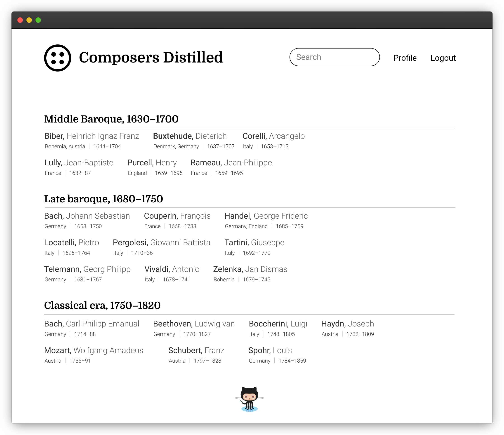

# Opus Classical

[https://opusclassical.net](https://opusclassical.net)



Curated structured lists of classical music periods, composers, genres, works and recordings with links to streaming services.

Read about [the idea](Docs/idea.md).

See design in [Figma](https://www.figma.com/file/YNiFyHcnkGEP7afuYFAinX/Composers?node-id=0%3A1).

Stack is .NET 5, C#, F#, Postgres, Docker.

## Database

Use Postgres 12 or later.

Restore with `pg_restore` from `Migrations` folder.

Dump was made with `pg_dump --dbname=composers --file="/Path/pg_dump_timestamp.sql" --no-owner` command.

## How to run with Docker

You need Postgres 12 database up and running somewhere on host or remotely. Earlier versions may or may not work.

You need to provide environment variable with the connection string for Postgres. 

Create `composers.env` file in solution folder (root folder)and set up

- hostname, username and database name;
- Sentry Dsn for tracking errors;
- Umami key for gathering page statistics; 
- Secret key for signing JWTs.

```
ConnectionStrings:PostgresConnection=Host=host.docker.internal;Username=foobar;Database=composers
Sentry:Dsn=https://sentry_dsn
Umami:foobar
SecretKey:foobar
```

Have `docker` and `docker-compose` installed.

Then run

```shell
$ docker-compose up -d
```

Site should be available at `http://localhost:5000/`